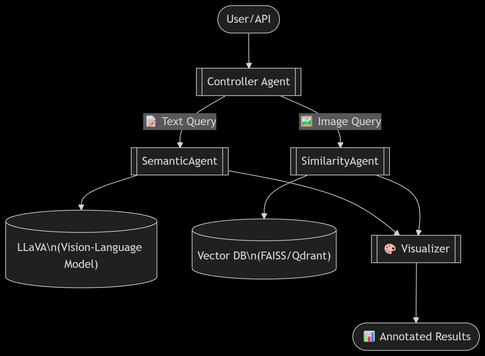

## 🧠 MultiAgent Vision Intelligence (MAVI)

A modular, multi-agent AI system that uses **LLaVA (Large Language and Vision Assistant)** to process images for **semantic understanding** and **similarity-based retrieval**. This project combines the strengths of vision-language models with autonomous agents to create a scalable, intelligent annotation and search engine.

---

## 🚀 Key Features

- 🔍 **Semantic Search**: Understand and query images using natural language prompts.
- 🔗 **Similarity Search**: Retrieve images with similar visual or contextual features.
- 🤖 **Multi-Agent Architecture**: Independent agents handle tasks like embedding, querying, indexing, and reasoning.
- 🧩 **Pluggable Agents**: Easily swap models or services (e.g., LLaVA, FAISS, OpenAI, etc.)
- 🖼️ **Vision-Language Integration**: Powered by LLaVA for interpreting image content using LLMs.

---

## 🧬 System Architecture




## 🧱 Components

| Agent             | Description                                                                 |
|------------------|-----------------------------------------------------------------------------|
| `SemanticAgent`   | Uses LLaVA to perform reasoning and image captioning.                       |
| `SimilarityAgent` | Embeds input and finds similar items using vector DBs like FAISS or Qdrant. |
| `Controller`      | Routes user queries to the appropriate agent(s).                            |
| `Visualizer`      | Optional — overlays results, annotations, or outputs.                       |

---

## 🛠 Installation

### 1. Clone the repository
```bash
git clone https://github.com/your-username/multiagent-vision-intelligence.git
cd multiagent-vision-intelligence
````

### 2. Install dependencies

```bash
pip install -r requirements.txt
```

### 3. Install Ollama and Pull LLaVA Model

> ℹ️ [Ollama installation guide](https://ollama.com/download)

```bash
# Install Ollama if not already installed
# Then run:
ollama pull llava:latest
ollama serve
```

Make sure Ollama is running at `http://localhost:11434`.

---

## 🧪 Usage

```bash
uvicorn main:app --reload
```

Then:

* 📤 Upload an image or send a text prompt
* 🔁 Use endpoints like:

```
POST /search/semantic
POST /search/similarity
```

---

## 📦 Technologies

* **FastAPI** – REST API backend
* **LLaVA** – Vision-language model served locally via Ollama
* **ChromaDB** – Similarity search engine
* **NumPy, OpenCV, PIL** – Image processing
* **AutoGen Agents** – Multi-agent orchestration

---

## 📝 Citation / Attribution

Please cite or credit this repository if used in your work.
See [LICENSE](LICENSE) for terms.

```bibtex
@misc{kameshwaran2025multiagent,
  author = {Kameshwaran S.},
  title = {MultiAgent Vision Intelligence},
  year = {2025},
  url = {https://github.com/Kameshwaran-45/multiagent-vision-intelligence}
}
```

---

## 🤝 Contributing

Contributions, ideas, and improvements are welcome!
Please open an issue or submit a pull request.
